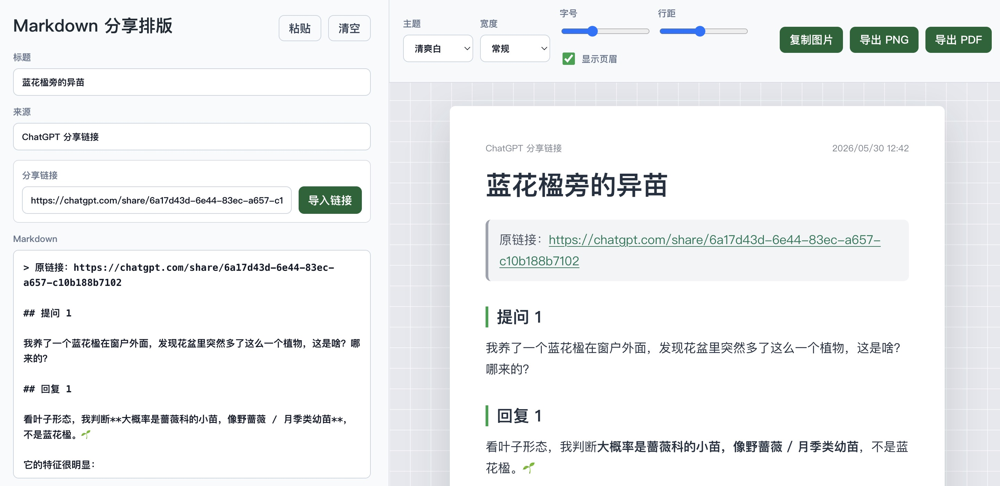

# Markdown Share Tool

把 Markdown 格式的 AI 回复整理成适合微信、Telegram、群聊转发的阅读版页面，并支持导出长图和 PDF。

这个工具最初是为了解决一个很具体的问题：AI 回复通常带有标题、列表、表格、加粗、代码块等 Markdown 结构，直接复制到微信里会变得很难读。这个项目把这些内容重新排版成简洁的阅读卡片，方便截图、导出 PNG/PDF，或者由 Telegram Bot 自动生成图片发回聊天框。



## 功能

- 粘贴 Markdown 后即时预览
- 支持 ChatGPT / Gemini 公开分享链接导入
- 支持服务端生成 PNG，方便 Bot、自动化脚本、NAS 服务调用
- 支持标题、来源、页眉开关
- 支持清爽白、深色、微信绿、暖灰主题
- 支持窄版、常规、宽版排版
- 支持字号和行距调整
- 支持导出 PNG、PDF
- 支持浏览器可用时直接复制图片到剪贴板
- 支持表格、列表、引用、代码块、加粗等常见 Markdown 格式

## 快速开始

### 本地运行

需要 Node.js 20 或更新版本。

```bash
git clone https://github.com/riddikuluswen/markdown-share-tool.git
cd markdown-share-tool
npm install
npm run dev
```

默认地址：

```text
http://127.0.0.1:5173
```

### Docker 运行

```bash
git clone https://github.com/riddikuluswen/markdown-share-tool.git
cd markdown-share-tool
docker compose up -d --build
```

打开：

```text
http://localhost:5173
```

如果运行环境需要代理才能访问 ChatGPT / Gemini 分享页，可以在 `docker-compose.yml` 里打开并调整这些环境变量：

```yaml
HTTP_PROXY: http://host.docker.internal:7890
HTTPS_PROXY: http://host.docker.internal:7890
ALL_PROXY: socks5://host.docker.internal:7890
```

只粘贴 Markdown 内容时不需要外网访问。

## 分享链接导入

页面左侧可以粘贴：

```text
https://chatgpt.com/share/...
https://gemini.google.com/share/...
```

服务端会尝试读取公开分享页，并整理成同一套 Markdown 阅读版。

需要注意：

- 分享页必须是公开可访问链接。
- ChatGPT 分享页里的图片通常不是公开直链，项目会保留图片位置、标题、文件标识和尺寸；如果没有登录态或原图直链，不能保证还原原图。
- Gemini 分享页内容依赖公开页面接口，如果 Google 调整接口，解析逻辑可能需要更新。
- 在中国大陆网络环境里，解析 ChatGPT / Gemini 链接通常需要代理。

## HTTP 接口

这个服务可以作为独立渲染 API 使用，适合接入 Telegram Bot、Hermes、快捷指令或其它自动化工具。

### 生成 PNG

```http
POST /api/render-image
Content-Type: application/json
```

请求：

```json
{
  "text": "Markdown 内容，或 ChatGPT/Gemini 分享链接",
  "title": "可选标题",
  "source": "可选来源"
}
```

返回：`image/png`

响应头：

- `x-render-title`
- `x-render-source`

### 生成 Base64 JSON

```http
POST /api/render-json
Content-Type: application/json
```

请求：

```json
{
  "text": "Markdown 内容，或 ChatGPT/Gemini 分享链接",
  "title": "可选标题",
  "source": "可选来源"
}
```

返回：

```json
{
  "title": "标题",
  "source": "来源",
  "filename": "标题.png",
  "mimeType": "image/png",
  "imageBase64": "..."
}
```

### 导入分享链接

```http
POST /api/import-share
Content-Type: application/json
```

请求：

```json
{
  "url": "https://chatgpt.com/share/..."
}
```

返回整理后的标题、来源和 Markdown 内容。旧接口 `/api/import-chatgpt` 仍保留，用于兼容之前的调用。

## Hermes / Telegram Bot 接入

这个项目不接管 Telegram Bot。推荐结构是：

```text
Telegram Bot -> Hermes / 自动化脚本 -> Markdown Share Tool -> PNG 图片 -> Telegram
```

Hermes 收到用户消息后，可以调用：

```text
http://markdown-share-tool:5173/api/render-json
```

或者在 NAS 局域网里使用：

```text
http://NAS内网IP:5173/api/render-json
```

仓库里的 `docker-compose.hermes.yml` 是一个示例，里面包含固定容器名、固定 IP、代理配置和外部 Docker 网络。它适合已经有自定义 Docker 网络和代理容器的 NAS 用户，不适合作为通用配置直接运行。

普通用户请优先使用根目录的 `docker-compose.yml`。

## 环境变量

| 变量 | 默认值 | 说明 |
| --- | --- | --- |
| `HOST` | `127.0.0.1` | 服务监听地址。Docker 里通常设为 `0.0.0.0` |
| `PORT` | `5173` | 服务端口 |
| `INTERNAL_BASE_URL` | `http://127.0.0.1:5173` | 服务端渲染页面时访问自己的地址 |
| `HTTP_PROXY` / `HTTPS_PROXY` / `ALL_PROXY` | 空 | 解析 ChatGPT / Gemini 分享链接时使用的代理 |

## 开发

```bash
npm install
npm run dev
```

构建检查：

```bash
npm run build
```

服务入口是 `server.mjs`，前端主要在 `src/main.js` 和 `src/styles.css`。

## 已知限制

- ChatGPT 分享链接中的私有图片不一定能还原成原图。
- 分享页解析依赖第三方页面结构，ChatGPT / Gemini 改版后可能需要更新解析逻辑。
- 浏览器复制图片能力受浏览器权限和安全策略影响，不支持时请使用导出 PNG。
- 长内容会生成长图，部分聊天软件会压缩图片；需要更清晰时建议导出 PDF。

## License

MIT
